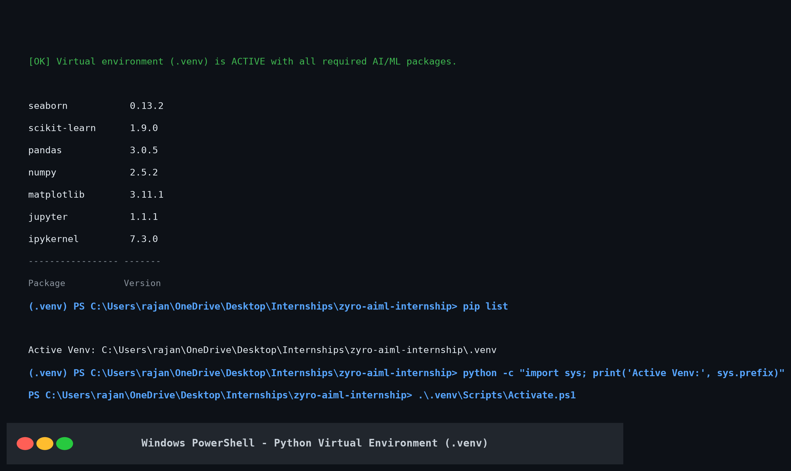
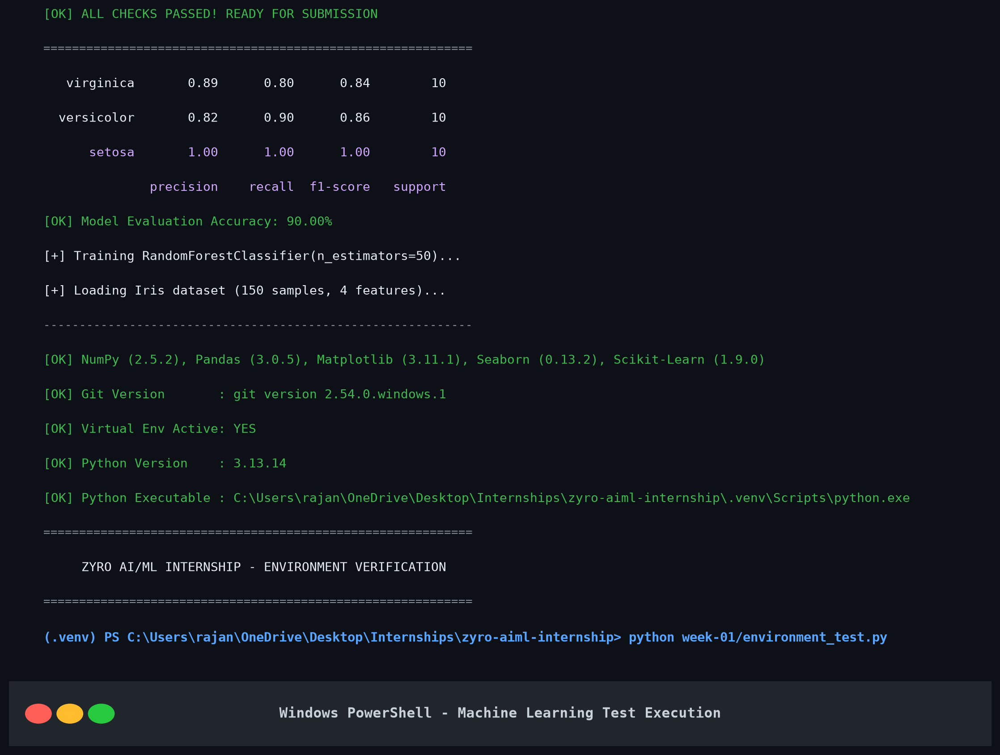

# Zyro AI/ML Internship - Week 1

Welcome to my repository for the **Zyro AI/ML Internship**! This repository tracks my weekly milestones, machine learning workflows, projects, and assignments.

---

## 📌 Week 1: Environment Setup & Tooling Verification

### Overview
The objective of Week 1 is to establish a standardized, isolated Python AI/ML environment, verify key data science & machine learning libraries, validate the setup using both a Python script and a Jupyter Notebook, and configure version control with Git and GitHub.

---

## 🛠️ Tech Stack & Dependencies

- **Python Version**: 3.13+
- **Version Control**: Git & GitHub
- **Interactive Computing**: Jupyter Notebook / VS Code Notebooks
- **AI/ML Core Libraries**:
  - `numpy` - Numerical computing & linear algebra
  - `pandas` - Data manipulation & tabular analysis
  - `matplotlib` - Static 2D data visualizations
  - `seaborn` - Statistical data graphics & themes
  - `scikit-learn` - Machine learning algorithms & evaluation metrics
  - `ipykernel` - Jupyter kernel for virtual environment

---

## 📂 Repository Structure

```text
zyro-aiml-internship/
├── .gitignore
├── README.md
├── requirements.txt
└── week-01/
    ├── environment_test.ipynb    # Interactive Jupyter Notebook test & ML pipeline
    └── environment_test.py       # Standalone environment & ML verification script
```

---

## 🚀 Getting Started

### 1. Clone the Repository
```bash
git clone https://github.com/<your-username>/zyro-aiml-internship.git
cd zyro-aiml-internship
```

### 2. Create & Activate Virtual Environment
**Windows (PowerShell):**
```powershell
python -m venv .venv
.\.venv\Scripts\Activate.ps1
```

**macOS / Linux:**
```bash
python3 -m venv .venv
source .venv/bin/activate
```

### 3. Install Dependencies
```bash
pip install --upgrade pip
pip install -r requirements.txt
```

### 4. Register Kernel with Jupyter
```bash
python -m ipykernel install --user --name=zyro-env --display-name="Python (zyro-env)"
```

---

## 🧪 Running the Verification

### Option A: Standalone Python Script
Run the automated verification script from the project root:
```bash
python week-01/environment_test.py
```
This script validates:
- Python version and active virtual environment
- Git version
- Successful import and versions of `numpy`, `pandas`, `matplotlib`, `seaborn`, `scikit-learn`, `jupyter`
- Machine learning pipeline execution (Iris dataset classification with Random Forest)

### Option B: Interactive Jupyter Notebook
Launch Jupyter Notebook or open in VS Code:
```bash
jupyter notebook week-01/environment_test.ipynb
```
Select the **Python (.venv)** or **Python (zyro-env)** kernel to execute all cells.


---

## 📷 Submission Proofs & Verification Screenshots

### 1. Virtual Environment (.venv) Verification


---

### 2. Machine Learning Test Execution


---


## 📬 Contact & Links
- **GitHub Profile**: [sohaib61595](https://github.com/sohaib61595)
- **GitHub Repository**: [zyro-aiml-internship](https://github.com/sohaib61595/zyro-aiml-internship)
- **Internship**: Zyro AI/ML Internship


