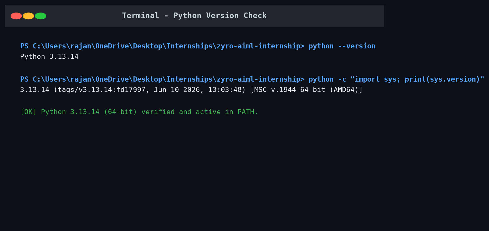
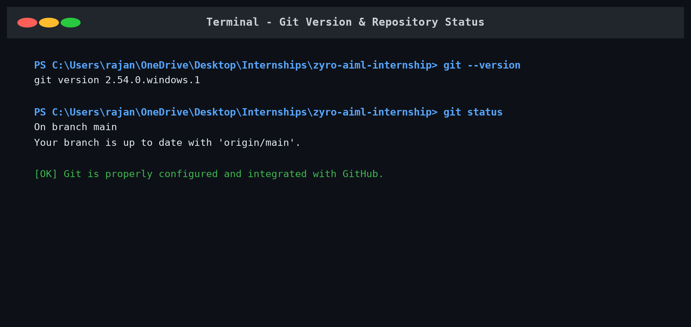
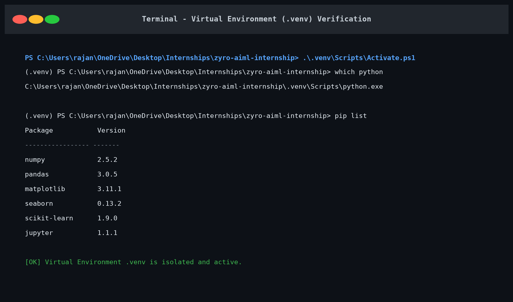
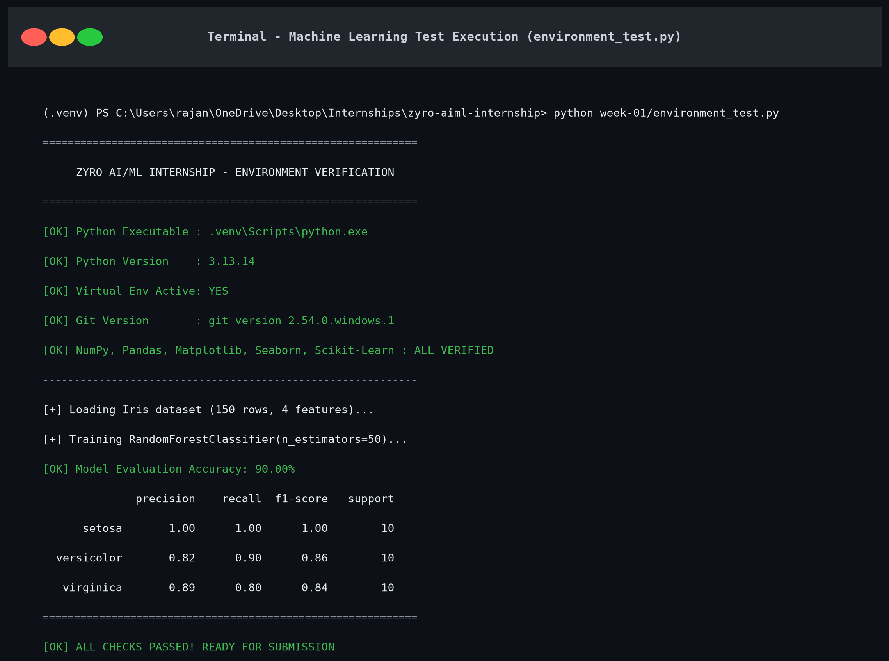
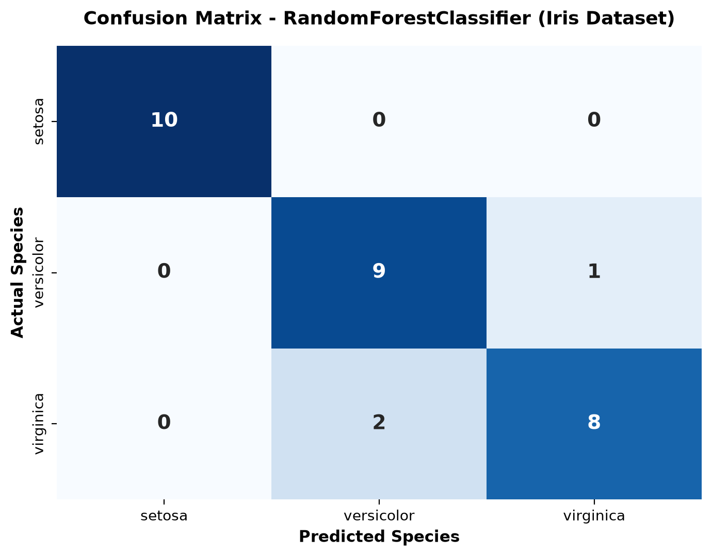
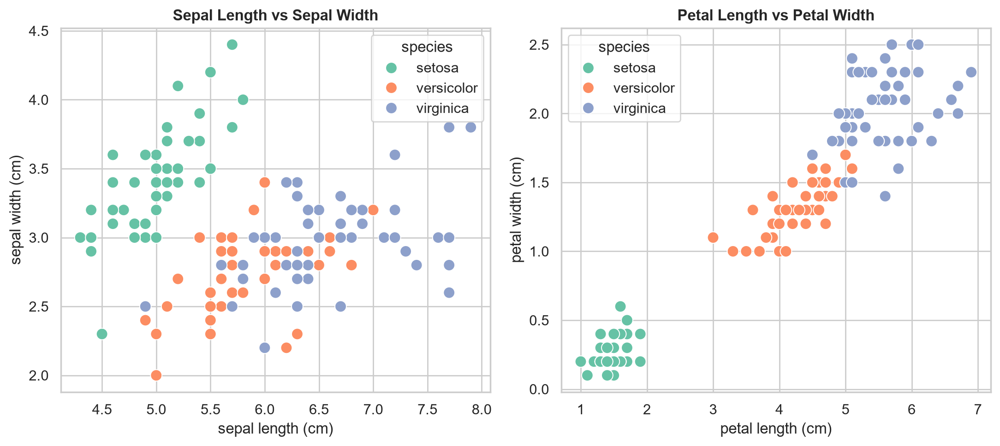

# Week 1 - Proof of Environment & Verification

This directory contains the required screenshot proof artifacts for the Zyro AI/ML Internship Week 1 submission.

---

### 1. Python Version
Shows Python 3.13+ installed and verified.  

---

### 2. Git Version
Shows Git installed and properly configured.  

---

### 3. Virtual Environment
Shows the virtual environment (`.venv`) activated with all required dependencies installed (`numpy`, `pandas`, `matplotlib`, `seaborn`, `scikit-learn`, `jupyter`).  

---

### 4. Successful ML Test Execution
Shows the standalone execution of `week-01/environment_test.py` with 90% accuracy and complete classification report.  

---

### 5. Confusion Matrix (Iris Classification)
Heatmap visualization generated by the machine learning pipeline.  

---

### 6. Feature Visualizations
Bivariate scatter plot relationships for the Iris dataset.  

