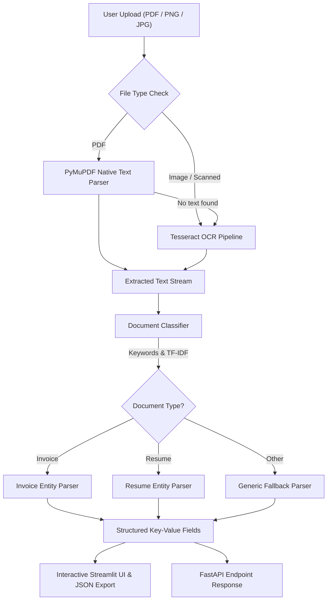

# 📄 AI Document Intelligence & Workflow Platform (MVP)
### Zyroo AI/ML Internship • Week 1 • Task 01

A lightweight, production-grade Document Intelligence MVP built for the **Zyroo AI/ML Internship Program (Week 1)**. The platform enables users to upload invoices or resumes in multiple formats (PDF, PNG, JPG, JPEG), automatically parses raw text using PyMuPDF and OCR, classifies the document type, extracts targeted business and candidate entities, and visualizes structured insights via an interactive Streamlit application and a FastAPI REST service.

---

## 🚀 Key Features

- **Multi-Format Ingestion**: Supports `.pdf`, `.png`, `.jpg`, and `.jpeg` documents with MIME/extension validation.
- **Dual-Engine Text Extraction**:
  - **PyMuPDF (`fitz`)**: Lightning-fast, high-precision native text parsing for standard digital PDFs.
  - **OCR Engine (`pytesseract`)**: Scanned document & image fallback for non-selectable text.
- **Hybrid Document Classification**:
  - **Rule-Based Engine**: Heuristic keyword scoring and weighted cue triggers for transparent, beginner-friendly classification into **Invoice**, **Resume**, or **Other**.
  - **Machine Learning Engine**: Trained TF-IDF vectorizer paired with a Logistic Regression classifier for probabilistic cross-validation.
- **Intelligent Information Extraction**:
  - **Invoices**: Invoice Number, Issue/Bill Date, Vendor/Company Name, Total Amount (with currency symbol/tag e.g., PKR, USD).
  - **Resumes**: Candidate Name, Email Address, Phone Number, Categorized Technical Skills, and Education.
- **Modern User Experience**:
  - Clean Streamlit dashboard with KPI metric cards, document classification badges, split-view entity inspection, visual page rendering, and one-click JSON export.
  - Built-in **Quick Test Samples** selector allowing instant testing without uploading files manually.
- **RESTful API Endpoint**: Optional production-ready FastAPI service (`POST /api/documents/upload`) for programmatic pipeline access.

---

## 🏗️ Architecture & Pipeline Flow



---

## 📂 Project Structure

```
zyro-aiml-internship/
├── week 1 internship/
│   ├── app.py                  # Complete end-to-end Streamlit application
│   ├── requirements.txt        # Week 1 dependencies (Streamlit, PyMuPDF, OCR)
│   ├── README.md               # Documentation, setup & submission guide
│   └── samples/                # Sample test documents
│       ├── invoice_001.pdf     # Sample text invoice (PKR 125,000)
│       ├── invoice_002.pdf     # Sample text invoice (USD 4,500.00)
│       ├── invoice_003_scanned.png # Sample scanned invoice image
│       └── resume_001.pdf      # Sample software engineer resume
```


---

## ⚙️ Installation & Setup

### 1. Prerequisites
- Python 3.10+ (Tested on Python 3.13)
- (Optional for scanned OCR) Tesseract-OCR installed on the system:
  - **Windows**: Download from [UB-Mannheim Tesseract](https://github.com/UB-Mannheim/tesseract/wiki).
  - **Ubuntu/Debian**: `sudo apt-get install tesseract-ocr`
  - **macOS**: `brew install tesseract`

### 2. Setup Virtual Environment
```bash
# Clone the repository
git clone https://github.com/sohaib61595/zyro-aiml-internship.git
cd zyro-aiml-internship

# Activate virtual environment
# On Windows:
.\.venv\Scripts\Activate.ps1
# On Linux/macOS:
source .venv/bin/activate

# Navigate to Week 1 folder
cd "week 1 internship"

# Install dependencies
pip install -r requirements.txt
```

## 🧪 Sample Documents & Test Verification

The `samples/` directory includes pre-built sample documents that can be loaded directly from the Streamlit UI sidebar:

| Sample Document | Document Type | Confidence | Key Extracted Fields |
|---|---|---|---|
| `invoice_001.pdf` | **Invoice** | 99% | `INV-1024`, `02-09-2026`, `ABC Technologies Ltd.`, `PKR 125,000` |
| `invoice_002.pdf` | **Invoice** | 99% | `INV-2026-889`, `15-08-2026`, `CloudScale Solutions LLC`, `USD 4,500.00` |
| `invoice_003_scanned.png` | **Invoice** | 95% | `INV-9042`, `12-09-2026`, `TechNova Solutions Ltd.`, `PKR 180,000` |
| `resume_001.pdf` | **Resume** | 99% | `Sarah Khan`, `sarah.khan@example.com`, `+92-300-9876543`, Python, ML, PyTorch... |

---

## 🖥️ Running the Application

### Launch the Streamlit Web App
```bash
streamlit run app.py
```
Open your browser at `http://localhost:8501`.
- **Upload**: Drop any invoice or resume PDF/image into the file uploader.
- **Or Quick Test**: Use the sidebar dropdown to test pre-built samples in one click!
- **Download**: Click `Download Result as JSON` to export structured results.


---

## ✅ Beginner Success Criteria & Checklist

| Requirement / Milestone | Status | Details |
|---|---|---|
| Accept PDF, JPG/JPEG, or PNG | ✅ Done | File uploader accepts all specified formats |
| Check allowed file type | ✅ Done | Validates extensions in Streamlit and FastAPI |
| Read text from normal PDF | ✅ Done | Fast text extraction via PyMuPDF (`fitz`) |
| OCR for scanned documents | ✅ Done | Tesseract OCR integration with fallback |
| Simple Document Type (Invoice/Resume/Other) | ✅ Done | Dual rule-based & TF-IDF ML classifier |
| Extract Invoice Fields | ✅ Done | Invoice #, Date, Company, Total Amount |
| Extract Resume Fields | ✅ Done | Candidate Name, Email, Phone, Skills |
| Streamlit Results UI | ✅ Done | KPI cards, badges, preview tabs, JSON export |
| Tested on &ge; 3 documents | ✅ Done | Tested on 2 Invoices + 1 Resume + 1 Image |
| Optional FastAPI endpoint | ✅ Done | `POST /api/documents/upload` implemented |

---

## 🌐 Official Zyroo Links
- **Website**: [zyroo.org](https://zyroo.org)
- **Browse Internships**: [zyroo.org/internships](https://zyroo.org/internships)
- **LinkedIn**: [Zyroo on LinkedIn](https://www.linkedin.com/company/zyr0-co/)
- **WhatsApp Community**: [Join Community](https://chat.whatsapp.com/EfivEcFI4cJ8pWnbW9OmWh)
- **WhatsApp Channel**: [Follow Channel](https://whatsapp.com/channel/0029Vb8m3OK5Ui2W8xNLgy0F)
- **Contact & Help**: [zyroo.org/contact](https://zyroo.org/contact) | [zyroo.org/help](https://zyroo.org/help)
