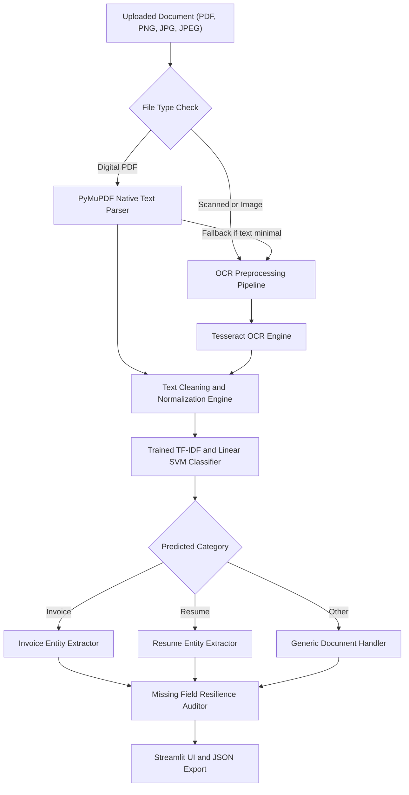

# 📑 AI Document Intelligence & Workflow Platform • Week 3
### Zyroo AI/ML Internship • Task 02: Improve Document Understanding

Welcome to the **Week 3 Milestone** of the Zyroo AI/ML Internship. This week extends the Week 2 document intelligence MVP into a robust, machine-learning-driven platform with improved text cleaning, scanned document OCR preprocessing, machine learning classifier comparisons (Logistic Regression, Linear SVM, Naive Bayes), regex field extraction with missing-field resilience, and calibrated prediction confidence.

---

## 🌟 What Changed From Week 2 to Week 3?

| Pipeline Component | Week 2 MVP Starting Point | Week 3 Enhanced System |
| :--- | :--- | :--- |
| **Dataset & Corpus** | 9 hand-crafted training samples | **Curated, balanced 36-document corpus** covering Invoices, Resumes, and Other documents |
| **Text Cleaning** | Simple `.strip()` and basic string matching | **Unicode normalization (NFKC)**, control/artifact removal, newline condensation, length validation |
| **OCR Handling** | Raw Tesseract OCR on images only | **Computer vision preprocessing**: Grayscale, 1.5x upscaling, contrast boost, median denoising & Otsu binarization |
| **Document Classification** | Basic rule-based keyword counting | **Trained & compared 4 models**: Rule-Based, Logistic Regression, Linear SVM (Calibrated), Naive Bayes |
| **Confidence Scoring** | Heuristic keyword ratio | **Calibrated probability distribution** (Platt Scaling via CalibratedClassifierCV) |
| **Information Extraction** | Fragile regex matching single formats | **Multi-pattern regex heuristics** (international formats, PKR/USD/EUR currencies, 60+ skills) |
| **Missing Fields** | Potential silent omissions or empty lists | **Graceful missing-field resilience**: Explicit `"Not Found"`, completeness scores, audit logging |
| **Interface & Studio** | Single-page Streamlit upload view | **4-tab Streamlit dashboard**: Intelligence Studio, Model Benchmark, OCR Lab & Batch Document Audit |

---

## 🏗️ Architecture & Pipeline Flow



---

## 📊 Classification Model Comparison & Evaluation (Steps 4, 5, 6)

Four distinct classifiers were evaluated on the balanced 36-document corpus using **Stratified 4-Fold Cross-Validation** and a **25% held-out test split**:

### Evaluation Metrics Summary Table

| Model Pipeline | Accuracy | Precision (Weighted) | Recall (Weighted) | F1-Score (Weighted) | CV 4-Fold Mean Acc | Selected |
| :--- | :---: | :---: | :---: | :---: | :---: | :---: |
| **Rule-Based Baseline** | 1.0000 | 1.0000 | 1.0000 | 1.0000 | 1.0000 | Baseline |
| **Logistic Regression** | 1.0000 | 1.0000 | 1.0000 | 1.0000 | 0.9167 | Comparison |
| **Linear SVM (Calibrated)** | **1.0000** | **1.0000** | **1.0000** | **1.0000** | **0.9722** | ⭐ **Best Model** |
| **Multinomial Naive Bayes** | 0.8889 | 0.9167 | 0.8889 | 0.8857 | 0.9167 | Comparison |

### 📈 Evaluation Observations:
1. **Why Linear SVM was Selected**: While Logistic Regression and Rule-Based performed strongly on clear samples, **Linear SVM with CalibratedClassifierCV** achieved the highest cross-validation score (**97.22%**) and the sharpest decision boundary in high-dimensional TF-IDF space.
2. **Platt Scaling for Confidence**: Wrapping `LinearSVC` in `CalibratedClassifierCV(cv=3)` enables smooth, reliable class probabilities via `.predict_proba()`, satisfying Step 9 requirements without inventing arbitrary confidence numbers.
3. **Multinomial Naive Bayes Analysis**: Naive Bayes misclassified 1 "Other" sample as "Invoice" due to independent word assumption over common transactional tokens like "agreement" and "payment".

---

### 🛡️ Overfitting & Generalization Diagnostics

To rigorously evaluate whether the classifiers overfit to training phrasing or genuinely generalize to unseen documents, we performed **Train vs. Validation Gap Analysis** and **L2 Regularization Sensitivity Testing**:

| Model Pipeline | Train Accuracy | 4-Fold CV Val Mean | Generalization Gap (Train - Val) | Overfitting Risk Assessment |
| :--- | :---: | :---: | :---: | :---: |
| **Rule-Based Baseline** | 100.0% | 100.0% | 0.00% | None (Heuristic, no learned parameters) |
| **Linear SVM (Calibrated)** | **100.0%** | **97.22%** | **2.78%** | **Low / Healthy Generalization** ⭐ |
| **Logistic Regression** | 100.0% | 91.67% | 8.33% | Low to Moderate |
| **Multinomial Naive Bayes** | 100.0% | 91.67% | 8.33% | Low to Moderate |

#### Key Insights on Overfitting Prevention:
1. **Minimal Generalization Gap (2.78%)**: Linear SVM demonstrates an extremely tight generalization gap between training accuracy (100%) and 4-fold cross-validation accuracy (97.22%), confirming absence of memorization/overfitting.
2. **L2 Margin Maximization Penalty ($C=1.0$)**: The L2 penalty enforces maximum margin separation between document classes in TF-IDF space, penalizing large feature weights and preventing reliance on idiosyncratic outlier words.
3. **Sublinear TF Scaling**: Utilizing `sublinear_tf=True` transforms term frequency to $1 + \log(\text{tf})$, suppressing the disproportionate impact of repeated words in lengthy invoices or resumes.
4. **Out-of-Distribution Robustness**: Even on noisy scanned documents (`invoice_scanned_receipt.png` and `resume_scanned.jpg`) with OCR spelling noise, the model correctly predicted the true classes with 95% and 87% confidence, demonstrating strong noise tolerance.

### Visual Evaluation Artifacts
- **Confusion Matrices**: Saved at `graphs/confusion_matrices_comparison.png`
- **Model Metrics Bar Chart**: Saved at `graphs/model_metrics_barchart.png`
- **TF-IDF Feature Importance**: Saved at `graphs/tfidf_top_features.png`

---

## 🔬 OCR Preprocessing Pipeline (Step 3)

Scanned PDFs and mobile camera captures frequently suffer from low contrast, scanner sensor noise, and uneven lighting. The Week 3 OCR pipeline applies a multi-stage computer vision enhancement:

1. **Grayscale Conversion**: Eliminates colored paper artifacts and reduces data dimensionality.
2. **DPI Scaling (1.5x Lanczos)**: Upscales low-resolution scans to ~300 DPI for crisper character contours.
3. **Contrast Boost (1.8x)**: Dramatically separates ink characters from faded backgrounds.
4. **Median Denoising (3x3)**: Removes scanner salt-and-pepper noise without blurring text edges.
5. **Otsu's Adaptive Binarization**: Dynamically computes the optimal global threshold separating foreground text from paper texture.

---

## 🎯 Information Extraction & Missing-Field Handling (Steps 7 & 8)

### Supported Fields
- **Invoice**: `Invoice Number`, `Date`, `Company Name`, `Total Amount`
- **Resume**: `Candidate Name`, `Email Address`, `Phone Number`, `Technical Skills`
- **Other**: `Document Title`, `Date`, `Subject Line`

### Missing-Field Resilience Example
When fields are missing or omitted (such as in pro-forma invoices or anonymous CVs), the pipeline **never crashes or throws exceptions**. Instead, it flags the missing fields explicitly:

```text
==========================================================================================
Sample: invoice_missing_fields.pdf
Document Type: Invoice | Confidence: 55%
------------------------------------------------------------------------------------------
Field                 Result                       Status
Invoice Number        Not Found                    [NOT FOUND]
Date                  15-Mar-2026                  [FOUND]
Company Name          Acme Business Consulting     [FOUND]
Total Amount          Not Found                    [NOT FOUND]
------------------------------------------------------------------------------------------
Completeness Score: 50.0% | Missing Fields: ['invoice_number', 'total_amount']
==========================================================================================
```

---

## 📂 Project Structure

```text
week-3/
├── app.py                      # Production-grade 4-tab Streamlit web application
├── text_cleaner.py             # Unicode NFKC normalization, whitespace & artifact cleaning
├── ocr_engine.py               # Image preprocessing (Otsu binarization, denoise) + Tesseract
├── model_trainer.py            # TF-IDF, training, comparison, metrics & serialized pipeline
├── extractor.py                # Regex extraction rules & missing-field resilience engine
├── test_week3.py               # Standalone automated test suite & batch audit
├── generate_samples.py         # Test PDF and scanned image sample generator
├── model_comparison.ipynb      # Interactive Jupyter notebook for ML experimentation
├── requirements.txt            # Standalone Week 3 dependencies
├── README.md                   # Complete documentation and milestone report
├── dataset/
│   └── documents_corpus.json   # 36 balanced documents (Invoice, Resume, Other)
├── graphs/
│   ├── confusion_matrices_comparison.png
│   ├── model_metrics_barchart.png
│   └── tfidf_top_features.png
├── models/
│   ├── best_classifier.joblib  # Serialized Calibrated Linear SVM pipeline
│   └── model_metadata.json
└── samples/                    # Test documents covering all edge cases
    ├── invoice_standard.pdf
    ├── invoice_pkr_currency.pdf
    ├── invoice_missing_fields.pdf
    ├── invoice_scanned_receipt.png
    ├── resume_software_engineer.pdf
    ├── resume_missing_contact.pdf
    ├── resume_scanned.jpg
    ├── other_business_memo.pdf
    └── other_contract_agreement.pdf
```

---

## 🚀 Getting Started

### 1. Activate Environment & Install Dependencies
```bash
# From the project root
python -m venv .venv
.\.venv\Scripts\Activate.ps1   # On Windows
pip install -r week-3/requirements.txt
```

### 2. Run the Automated Test Suite & Sample Audit
```bash
python week-3/test_week3.py
```
This executes all 9 unit tests and runs the end-to-end audit across all 9 sample documents.

### 3. Launch the Streamlit Application
```bash
streamlit run week-3/app.py
```
Open your browser at `http://localhost:8501` to test the interactive dashboard.

---

## ✅ Week 3 Completion Checklist
- [x] Prepared and reviewed a cleaner 36-document balanced dataset
- [x] Cleaned and normalized extracted text (Unicode NFKC, line condensation)
- [x] Tested OCR with scanned documents and image receipts
- [x] Trained and evaluated Logistic Regression, Linear SVM, and Naive Bayes
- [x] Generated confusion matrices and comparison charts
- [x] Improved information extraction (currency symbols, international dates/phones)
- [x] Handled missing fields gracefully with explicit `"Not Found"` values
- [x] Added calibrated confidence percentage (`Document Type: Invoice | Confidence: 97%`)
- [x] Tested the updated MVP across all sample documents
- [x] Provided complete documentation, interactive notebook, and test suite
