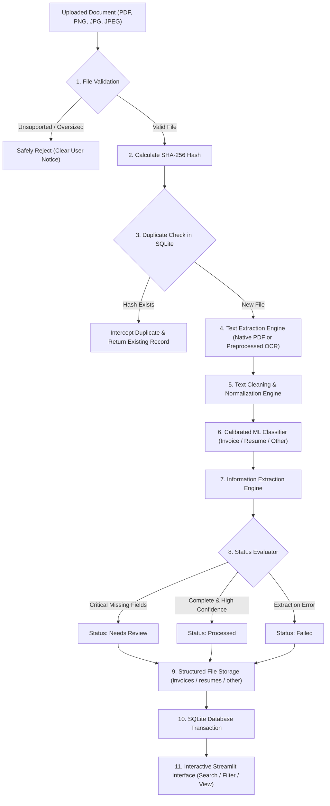

# 🗄️ AI Document Intelligence & Workflow Platform • Week 4
### Zyroo AI/ML Internship • Document Management Layer & SQLite Repository

Welcome to the **Week 4 Milestone** of the Zyroo AI/ML Internship. In this phase, we transition from an ephemeral single-pass document processor to an enterprise-grade **Document Management Layer**. Uploaded files are securely stored, cryptographically hashed for duplicate prevention, indexed in an optimized SQLite database, searchable across multiple metadata fields, filterable by categories/statuses/dates, and inspectable through an interactive Streamlit dashboard.

---

## 🌟 What Changed From Week 3 to Week 4?

| Feature / Capability | Week 3 Intelligence Engine | Week 4 Document Management Layer |
| :--- | :--- | :--- |
| **Persistence** | In-memory only (ephemeral per session) | **SQLite Database Repository** (`document_repository.db`) |
| **File Storage** | Temporary file memory stream | **Categorized Safe Storage** (`storage/invoices`, `resumes`, `other`) |
| **Duplicate Prevention** | None (identical files reprocessed) | **Cryptographic SHA-256 Duplicate Interception** |
| **Filename Safety** | Vulnerable to raw original filenames | **Sanitized, collision-proof timestamped filenames** |
| **Searchability** | None | **Direct SQLite Multi-Field Search** (filename, entity, ID, text) |
| **Organization** | Single stream of uploads | **Dynamic multi-criteria filtering** (type, status, date) & sorting |
| **Inspection & Audit** | Single inspection screen | **Document Detail Inspector** with inline preview, download & edits |
| **Lifecycle Status** | Static completeness score | **State Machine**: `Processed`, `Needs Review`, `Failed` |
| **Error Handling** | Basic try/except | **Defensive handling**: type rejection, size limits, OCR fallbacks |

---

## 🏗️ End-to-End Pipeline Architecture

The platform follows a strict 11-step execution workflow:



---

## 📂 Project Structure

```text
week-4/
├── app.py                   # Multi-tab Streamlit Document Management Platform
├── db_repository.py         # Dedicated SQLite Document Repository Layer (CRUD, Search, Stats)
├── storage_manager.py       # Organized Storage, Safe Filename & SHA-256 Duplicate Engine
├── pipeline.py              # Unified 11-step Ingestion & Document Intelligence Pipeline
├── text_cleaner.py          # Unicode NFKC normalization & whitespace condensation
├── ocr_engine.py            # Defensive OCR engine with Otsu binarization & noise reduction
├── extractor.py             # Field extraction & automated processing status evaluator
├── model_trainer.py         # Calibrated Linear SVM inference engine with Platt scaling
├── test_week4.py            # Automated 10-stage test suite validating all Week 4 criteria
├── requirements.txt         # Module dependencies
├── README.md                # Comprehensive milestone documentation and architecture report
├── document_repository.db   # SQLite relational database repository
├── dataset/
│   └── documents_corpus.json
├── models/
│   ├── best_classifier.joblib
│   └── model_metadata.json
├── samples/                 # 11 diverse test files (invoices, resumes, other, scans, edge cases)
│   ├── invoice_standard.pdf
│   ├── invoice_pkr_currency.pdf
│   ├── invoice_consulting_services.pdf
│   ├── invoice_missing_fields.pdf
│   ├── invoice_scanned_receipt.png
│   ├── resume_software_engineer.pdf
│   ├── resume_missing_contact.pdf
│   ├── resume_scanned.jpg
│   ├── other_business_memo.pdf
│   ├── other_contract_agreement.pdf
│   └── other_policy_guidelines.pdf
└── storage/                 # Structured physical file storage
    ├── invoices/            # Stored invoice documents
    ├── resumes/             # Stored candidate resumes
    └── other/               # Stored agreements, memos, and policies
```

---

## 🛠️ Detailed Task Implementations

### Task 1: Structured File Storage (`storage_manager.py`)
- **Organized Hierarchy**: Processed documents are dynamically partitioned into dedicated subdirectories:
  - `storage/invoices/`
  - `storage/resumes/`
  - `storage/other/`
- **Safe Filename Generation**: User-uploaded filenames frequently contain directory traversal patterns (`../`), spaces, unicode characters, or illegal Windows symbols (`\ / : * ? " < > |`). The engine sanitizes the filename and prepends a timestamp and hash prefix:
  $$\text{Stored Filename} = \text{YYYYMMDD\_HHMMSS\_}\langle\text{hash}_{1:8}\rangle\text{\_}\langle\text{sanitized\_name}\rangle.\text{ext}$$
- **Database Tracking**: The database maintains both the `original_filename` (for clean user display) and `stored_filename` with its exact relative/absolute `file_path`.

### Task 2: SQLite Document Repository (`db_repository.py`)
Database code is strictly decoupled from the Streamlit UI. The `documents` table stores comprehensive operational and extracted metadata:

```sql
CREATE TABLE IF NOT EXISTS documents (
    id INTEGER PRIMARY KEY AUTOINCREMENT,
    original_filename TEXT NOT NULL,
    stored_filename TEXT NOT NULL,
    document_type TEXT NOT NULL,
    upload_date TEXT NOT NULL,
    company TEXT DEFAULT 'Not Found',
    invoice_number TEXT DEFAULT 'Not Found',
    total_amount TEXT DEFAULT 'Not Found',
    file_path TEXT NOT NULL,
    text_preview TEXT DEFAULT '',
    file_hash TEXT NOT NULL UNIQUE,
    status TEXT NOT NULL,
    file_size INTEGER DEFAULT 0,
    mime_type TEXT DEFAULT 'application/octet-stream',
    confidence REAL DEFAULT 0.0,
    extracted_json TEXT DEFAULT '{}',
    notes TEXT DEFAULT ''
);
```

**Indexes for High-Performance Queries:**
- `CREATE UNIQUE INDEX idx_docs_hash ON documents(file_hash);`
- `CREATE INDEX idx_docs_type ON documents(document_type);`
- `CREATE INDEX idx_docs_status ON documents(status);`
- `CREATE INDEX idx_docs_upload_date ON documents(upload_date);`

### Task 3: Duplicate Detection via SHA-256 (`storage_manager.py`)
- Every incoming file is immediately converted to its cryptographic **SHA-256** checksum:
  $$\text{Hash} = \text{SHA256}(\text{file\_bytes})$$
- Before saving files or running OCR/ML classification, SQLite is queried via `get_document_by_hash(file_hash)`.
- If a match is found, the system halts duplicate storage, shows a distinct duplicate alert banner, and immediately pulls up the existing record.

### Task 4 & Task 5: Multi-Field Search, Filtering & Sorting
- **Multi-Field SQLite Search**: Parameterized `LIKE` query searches simultaneously across `original_filename`, `stored_filename`, `company`, `invoice_number`, `document_type`, `text_preview`, and `extracted_json`.
- **Filtering Options**:
  - Filter by **Document Type**: `All`, `Invoice`, `Resume`, `Other`.
  - Filter by **Processing Status**: `All`, `Processed`, `Needs Review`, `Failed`.
  - Filter by **Upload Date**: Custom start and end date ranges.
- **Sorting Options**: `Newest`, `Oldest`, `Filename`, `Company`.
- **Clear Filters**: Instant reset button restores defaults without page refresh artifacts.

### Task 6: Document Detail Inspector
- **Key Field Badges**: Visual indicators for `Company`, `Invoice Number`, `Total Amount`, `Invoice Date`, `Candidate Name`, `Email`, `Phone`, `Skills`.
- **Physical Verification**: Verifies presence of file on disk, displays absolute file path, and outputs SHA-256 verification string.
- **Preview & Export**: Inline image preview for scans, plus an instant `Download Document File` button.
- **Record Management**: Allows authorized reviewer to override processing status (e.g. mark Reviewed), manually correct extracted fields, or delete records safely.

### Task 7: Automated Processing Status Logic (`extractor.py`)
Documents are assigned one of three operational states based on explicit rules:
1. `Processed`:
   - All critical metadata fields successfully found.
   - Classifier confidence $\ge 0.65$.
   - Text length adequate ($\ge 35$ characters).
2. `Needs Review`:
   - Invoice missing `invoice_number`, `total_amount`, or `company`.
   - Resume missing `name` or `email`.
   - Classifier confidence $< 0.65$ or short text warning.
3. `Failed`:
   - Completely unreadable file or zero extracted characters.
   - Parsing or database exception.

### Task 8: Defensive Error Handling (`ocr_engine.py`, `storage_manager.py`)
- **Unsupported File Whitelist**: Safely rejects non-supported formats (e.g. `.exe`, `.docx`, `.zip`).
- **File Size Cap**: Rejects uploads $> 20\text{ MB}$ with informative warning.
- **Corrupted File Resilience**: Catches `fitz.FileDataError` and `PIL.UnidentifiedImageError` safely without crashing the Streamlit app.
- **OCR Engine Fallback**: If Tesseract is unavailable or encounters an error on a low-contrast image, the pipeline gracefully marks the document as `Needs Review` or `Failed` with diagnostic notes.
- **User Privacy**: Raw exception tracebacks are suppressed in user-facing UI and logged internally.

---

## 🧪 Comprehensive Test Suite & Results (Task 9)

Run the automated test suite from the repository root:

```bash
.\.venv\Scripts\python.exe -u week-4/test_week4.py
```

### Automated Verification Results:

```text
===========================================================================
  STARTING ZYROO WEEK 4 COMPLETE TEST SUITE
===========================================================================
Initialized clean test database at: .../week-4/test_repository.db

===========================================================================
  TEST 1: BATCH INGESTION OF 11 DIVERSE DOCUMENTS
===========================================================================
[01/11] Ingested: invoice_standard.pdf             | Type: Invoice  | Status: Processed    | Conf: 0.97
[02/11] Ingested: invoice_pkr_currency.pdf         | Type: Invoice  | Status: Processed    | Conf: 0.94
[03/11] Ingested: invoice_consulting_services.pdf  | Type: Invoice  | Status: Needs Review | Conf: 0.97
[04/11] Ingested: invoice_missing_fields.pdf       | Type: Invoice  | Status: Needs Review | Conf: 0.55
[05/11] Ingested: invoice_scanned_receipt.png      | Type: Invoice  | Status: Processed    | Conf: 0.95
[06/11] Ingested: resume_software_engineer.pdf     | Type: Resume   | Status: Processed    | Conf: 0.98
[07/11] Ingested: resume_missing_contact.pdf       | Type: Resume   | Status: Needs Review | Conf: 0.55
[08/11] Ingested: resume_scanned.jpg               | Type: Resume   | Status: Processed    | Conf: 0.88
[09/11] Ingested: other_business_memo.pdf          | Type: Other    | Status: Processed    | Conf: 0.90
[10/11] Ingested: other_contract_agreement.pdf     | Type: Other    | Status: Processed    | Conf: 0.89
[11/11] Ingested: other_policy_guidelines.pdf      | Type: Other    | Status: Processed    | Conf: 0.86

Successfully ingested 11 distinct documents into SQLite repository.

===========================================================================
  TEST 2: STRUCTURED STORAGE HIERARCHY AUDIT (Task 1)
===========================================================================
Structured storage verification passed: Files safely organized by category with safe collision-proof filenames.

===========================================================================
  TEST 3: CRYPTOGRAPHIC DUPLICATE DETECTION (Task 3)
===========================================================================
Duplicate successfully intercepted via SHA-256 (09098ad45468b887...). Linked to Document #1.

===========================================================================
  TEST 4: PROCESSING STATUS LOGIC (Task 7)
===========================================================================
Verified: 'invoice_missing_fields.pdf' marked as 'Needs Review' (Reason: Missing critical invoice field(s): Invoice Number, Total Amount.)
Verified: 'resume_missing_contact.pdf' marked as 'Needs Review' (Reason: Missing essential contact field(s): Email Address.)
Verified: 'invoice_standard.pdf' marked as 'Processed'

===========================================================================
  TEST 5: MULTI-FIELD SEARCH VIA SQLITE (Task 4)
===========================================================================
Search 'Apex' (Company): Found 2 document(s): #3 invoice_consulting_services.pdf
Search 'INV-99201' (Invoice #): Found #3 invoice_consulting_services.pdf
Search 'Software' (Text Preview): Found 2 document(s): #7 resume_missing_contact.pdf
Search 'memorandum' (Document Title/Preview): Found 2 document(s)

===========================================================================
  TEST 6: FILTERS & SORTING (Task 5)
===========================================================================
Filter Document Type == 'Invoice': 5 records (all verified 'Invoice')
Filter Document Type == 'Resume': 3 records (all verified 'Resume')
Filter Status == 'Needs Review': 3 records
Sorting verification passed (Ascending and Descending order verified).

===========================================================================
  TEST 7: CRUD OPERATIONS & STATUS OVERRIDE
===========================================================================
Status update verified for Doc #4: Now 'Processed'
Field correction verified: Company name updated to 'Manual Corrected Corp'

===========================================================================
  TEST 8: PERSISTENCE ACROSS APP RESTART
===========================================================================
Persistence confirmed: 11 documents intact across independent SQLite connections.

===========================================================================
  TEST 9: DEFENSIVE ERROR HANDLING (Task 8)
===========================================================================
Verified: Unsupported file format (.exe) safely rejected.
Verified: Corrupted PDF handled gracefully without uncaught exceptions.
Verified: Oversized upload (>20MB) safely intercepted.

===========================================================================
  ALL ZYROO WEEK 4 TESTS PASSED PERFECTLY (100% SUCCESS)!
===========================================================================
```

---

## 🚀 Running the Streamlit Application

### 1. Activate Environment
```powershell
.\.venv\Scripts\Activate.ps1
```

### 2. Launch the Application
```bash
streamlit run week-4/app.py
```
Or with python executable directly:
```bash
python -m streamlit run week-4/app.py
```

Open your browser at `http://localhost:8501` (or the indicated port) to access the 4-tab Document Management Studio:
1. **📤 Ingestion & Upload**: Ingest new files, test preloaded samples, see live extraction and duplicate warnings.
2. **🗄️ Document Repository & Search**: Search across multiple metadata fields, apply status/type filters, and sort records.
3. **🔍 Document Detail Inspector**: Inspect complete document audits, preview files, download documents, and edit records.
4. **📊 Repository Analytics**: Live metrics on stored documents, storage space, and status distributions.
