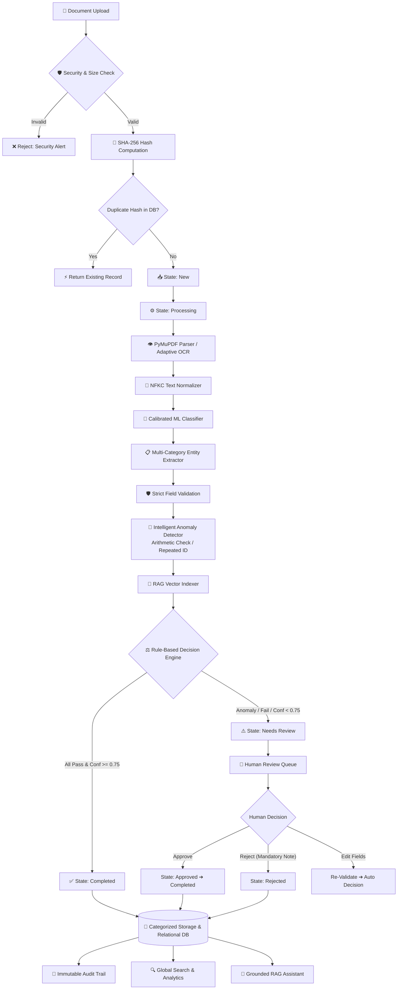

# ZYROO AI/ML Internship - Week 6: Final Integration, Optimization & Project Completion


%20Passed-success?style=for-the-badge)


---

## 📌 Executive Summary & Product Purpose

**Week 6 marks the culmination of the ZYROO AI/ML Internship Program**. Over Weeks 1 through 5, modular capabilities were constructed: environment setup (Week 1), document MVP (Week 2), computer vision preprocessing & OCR (Week 3), relational repository management & deduplication (Week 4), and workflow automation state machines (Week 5).

In **Week 6**, these disparate systems have been unified into a single, cohesive, enterprise-grade product: **The AI Document Intelligence & Workflow Platform**. 

The platform delivers an autonomous, end-to-end document lifecycle:
1. **Secure Ingestion**: File type, size, and magic-byte header validation with directory-traversal prevention.
2. **Cryptographic Deduplication**: SHA-256 hash checks that eliminate redundant processing.
3. **Computer Vision & OCR**: PyMuPDF native parsing paired with adaptive Otsu binarization and noise-reducing OCR fallback.
4. **Machine Learning Classification**: Calibrated Linear SVM (TF-IDF) predicting `Invoice`, `Resume`, `Contract`, and `Other` with genuine confidence scores.
5. **Entity Extraction**: Multi-category structured extraction (invoices, dates, line items, candidate profiles, skills, contract clauses).
6. **Multi-Point Validation**: Strict RFC email, international telephone, date plausibility, and positive currency amounts.
7. **Intelligent Anomaly Detection**: Automatic detection of financial arithmetic calculation mismatches (`Subtotal + Tax == Total Amount`), repeated invoice numbers, high-value policy thresholds ($10,000), and sparse text.
8. **Retrieval-Augmented Generation (RAG)**: Semantic sliding-window chunking, vector indexing, grounded question answering with provenance citations, and enforced negative constraints when document evidence is absent.
9. **Finite State Machine & Review**: Deterministic rule routing, Human Review Queue with in-place field editing, and Role-Based Access Control (`Admin`, `Reviewer`, `Viewer`).
10. **Immutable Auditing**: Complete chronological audit logging of every transition, automated decision, and human review note.
11. **Production Deployment**: Dual interfaces (Glassmorphic Streamlit Studio + FastAPI OpenAPI REST backend) containerized with Docker and Docker Compose.

---

## 🔄 End-to-End Final Product Flow



---

## 📂 Production Codebase Architecture

```
week-6/
├── .env.example              # Clean environment template (zero secrets exposed)
├── Dockerfile                # Multi-stage production container with Tesseract & Poppler
├── docker-compose.yml        # Multi-container orchestration (Streamlit UI + FastAPI API)
├── requirements.txt          # Pinned production dependencies
├── run_app.bat               # 1-Click launcher for Streamlit Web UI
├── run_api.bat               # 1-Click launcher for FastAPI REST backend
├── run_tests.bat             # 1-Click launcher for automated verification suite
├── config.py                 # Centralized configuration, thresholds & RBAC roles
├── storage.py                # Safe storage, directory-traversal defense & SHA-256 deduplication
├── database.py               # SQLite relational repository (WAL mode, documents, audit_log, rag_chunks)
├── processor.py              # PyMuPDF digital parser, Otsu binarization, OCR fallback & semantic chunker
├── classifier.py             # Calibrated Linear SVM (TF-IDF) with 0.75 confidence thresholding
├── extractor.py              # Multi-category entity extractor (Invoices, Resumes, Contracts, Other)
├── validator.py              # Format validators (RFC email, phone, date, positive amount, required fields)
├── anomaly.py                # Mathematical arithmetic check, duplicate identifier, and high-value alerts
├── rag_engine.py             # Semantic vector indexing, retrieval, citations & grounded Q&A engine
├── workflow.py               # Finite State Machine, rule decision engine, review queue & batch processor
├── audit.py                  # Immutable event logging and audit trail recorder
├── api.py                    # Production FastAPI REST backend with OpenAPI/Swagger docs & RBAC
├── app.py                    # Streamlit AI Document Intelligence & Workflow Studio UI (6 Tabs)
├── test_week6.py             # 14-scenario automated test suite (100% Quality Gate pass)
├── models/                   # Serialized ML classification pipelines
│   ├── best_classifier.joblib
│   └── model_metadata.json
├── samples/                  # Curated document suite covering all 14 test cases
└── storage/                  # Categorized physical file storage
    ├── invoices/
    ├── resumes/
    ├── contracts/
    └── other/
```

---

## 🛡️ Security, Protection & Production Hardening

| Security Layer | Implementation Detail | Guarantee |
| :--- | :--- | :--- |
| **Path Traversal Defense** | `storage.is_safe_path()` resolves target paths against base storage root | Prevents `../` directory traversal and unauthorized filesystem access |
| **Header Validation** | `MAGIC_SIGNATURES` validates binary file headers (`%PDF`, `\x89PNG`, `\xff\xd8`) | Prevents malicious executable files disguised as PDFs/images |
| **Upload Size Guard** | Configurable `MAX_UPLOAD_SIZE_BYTES` (25 MB limit) | Protects memory and disk from resource exhaustion |
| **Secret Isolation** | Configuration loaded via `config.py` from `.env`; template in `.env.example` | Zero secrets or tokens committed to version control |
| **Role-Based Access (RBAC)**| `Admin`, `Reviewer`, and `Viewer` roles enforced across API and UI | `Viewer` role cannot approve or reject documents |
| **Deduplication** | Cryptographic SHA-256 content hashing in SQLite index | Zero redundant reprocessing of identical files |

---

## 📐 Detailed Layer Responsibilities

### 1. Processing & OCR Layer (`processor.py`)
- Native PyMuPDF text extraction across multi-page digital PDFs.
- Automatic scanned document detection (`len(text) < 20`).
- Adaptive computer vision preprocessing: Grayscale conversion $\rightarrow$ Contrast enhancement ($2.0\times$) $\rightarrow$ Median filter denoising $\rightarrow$ Otsu adaptive binarization.
- Tesseract OCR fallback with graceful handling when OCR binaries are unavailable.
- Text cleaning: Unicode NFKC normalization, whitespace condensing, control character stripping.

### 2. Machine Learning Classification (`classifier.py`)
- Serialized Calibrated Linear SVM pipeline with TF-IDF n-grams (1, 2).
- Extracts probability distributions via `predict_proba()` without fabricating confidence scores.
- Documented threshold of **$\ge 0.75$** for automated processing; lower confidence documents are routed to `Needs Review`.

### 3. Entity Extraction & Validation (`extractor.py`, `validator.py`)
- **Invoices**: Invoice number, billing date, due date, vendor name, subtotal, tax/VAT, total amount, currency.
- **Resumes**: Candidate name, RFC-compliant email, phone number, technical skill taxonomy (60+ skills).
- **Contracts**: Title, parties, effective date, governing jurisdiction.
- **Validators**: RFC-compliant email regex, calendar plausibility checks (1950–2035), positive numeric amount parsing.

### 4. Anomaly Detection Engine (`anomaly.py`)
- **Financial Arithmetic Consistency**:
  $$\Delta = |(\text{Subtotal} + \text{Tax}) - \text{Total Amount}|$$
  If $\Delta > \$0.05$, flags `ANOMALY_ARITHMETIC_MISMATCH` with exact monetary discrepancy and routes to review.
- **Repeated Identifier Check**: Queries database for existing records with identical invoice numbers from distinct files (`ANOMALY_REPEATED_IDENTIFIER`).
- **High-Value Policy Audit**: Flags transactions meeting or exceeding $\$10,000$ (`ANOMALY_HIGH_VALUE_THRESHOLD`).
- **Sparse Text Warning**: Flags pages containing $< 50$ characters (`ANOMALY_SPARSE_TEXT`).

### 5. RAG Engine & AI Assistant (`rag_engine.py`)
- Semantic sliding-window chunker (350 chars with 60 chars overlap) preserving sentence and page boundaries.
- Vector indexing in SQLite `rag_chunks` table with TF-IDF cosine similarity retrieval.
- **Strict Grounding**: Synthesizes answers exclusively from retrieved chunks.
- **Source Citations**: Displays document name, page number, chunk index, and relevance score.
- **Enforced Negative Constraint**: If factual evidence is missing, explicitly responds:
  > *"The available documents do not contain enough information to answer this question."*

### 6. Workflow State Machine & Review Queue (`workflow.py`)
- Strict Finite State Machine: `New` $\rightarrow$ `Processing` $\rightarrow$ `Needs Review` / `Completed` $\rightarrow$ `Approved` $\rightarrow$ `Completed`.
- Illegal transitions (e.g. `New` $\rightarrow$ `Approved`, `Completed` $\rightarrow$ `Needs Review`) are blocked with `InvalidStateTransitionError`.
- Human Review Queue with in-place field editing and mandatory rejection reasons.
- Fault-tolerant batch processor: Individual file failures do not halt the batch.

### 7. Production REST API (`api.py`)
- FastAPI backend with interactive Swagger documentation (`/docs`).
- Endpoints for single/batch upload, document query, review actions, field editing, RAG assistant queries, and health checks.
- Standard HTTP status codes (200, 201, 400, 403, 404, 500) and Pydantic validation schemas.

---

## 🧪 Comprehensive Quality Gate Verification (14/14 Scenarios)

The automated test suite (`test_week6.py`) validates all required test cases:

```bash
python test_week6.py
```

### Verification Results Summary

| # | Scenario Tested | Input Sample | Expected Outcome | Result |
| :--- | :--- | :--- | :--- | :---: |
| **1** | Clean digital PDF | `invoice_standard.pdf` | Extracted, validated, auto-completed | **PASS** |
| **2** | Scanned document requiring OCR | `invoice_scanned_receipt.png` | OCR preprocessing triggered, text extracted | **PASS** |
| **3** | Multi-category support | `other_contract_agreement.pdf` | Contract entities extracted, status completed | **PASS** |
| **4** | Missing required fields | `invoice_missing_fields.pdf` | Validation failed, routed to 'Needs Review' | **PASS** |
| **5** | Duplicate document (SHA-256) | Re-submission of invoice | Detected via hash, returns existing record | **PASS** |
| **6** | Unsupported file type | `unsupported_file.exe` | Upload validation rejected with 400 error | **PASS** |
| **7** | Corrupted or unreadable file | `corrupted_document.pdf` | Defensive error trapped, no traceback crash | **PASS** |
| **8** | Low-confidence classification | `document_low_confidence_ambiguous.pdf`| Confidence (72.8%) < 75%, routed to review | **PASS** |
| **9** | Financial arithmetic mismatch | `invoice_arithmetic_mismatch.pdf` | Subtotal + Tax != Total flagged ($530 diff) | **PASS** |
| **10**| FSM illegal state transitions | `New ➔ Approved`, `Completed ➔ Review` | Strictly blocked by state machine | **PASS** |
| **11**| Review actions & RBAC | Human Approve / Reject | Mandatory reason enforced; Viewer blocked | **PASS** |
| **12**| Fault-tolerant batch ingestion| 4 mixed files (valid, corrupt, mismatch) | Batch completes without crashing | **PASS** |
| **13**| Application restart persistence| Simulated fresh app startup | All 17 documents & RAG chunks intact | **PASS** |
| **14**| RAG grounded Q&A & negative case| Positive vs ungrounded question | Positive answered with citations; Negative returns fallback | **PASS** |

**Final Quality Gate Pass Rate: 100.0% (14 / 14 Passed)**

---

## 🚀 Getting Started & Execution Guide

### 1. Clone & Environment Setup
```bash
git clone https://github.com/<your-username>/zyro-aiml-internship.git
cd zyro-aiml-internship
python -m venv .venv
.\.venv\Scripts\activate   # Windows
# or source .venv/bin/activate  # macOS / Linux
pip install -r week-6/requirements.txt
```

### 2. Configure Environment Variables
```bash
cp week-6/.env.example week-6/.env
```

### 3. Run the Automated Verification Suite
```bash
cd week-6
python test_week6.py
# or double-click run_tests.bat
```

### 4. Launch the Streamlit Web Application
```bash
cd week-6
streamlit run app.py
# or double-click run_app.bat
```
*Access in browser at:* `http://localhost:8501`

### 5. Launch the Production FastAPI REST Service
```bash
cd week-6
uvicorn api:app --reload --port 8000
# or double-click run_api.bat
```
*Access interactive Swagger documentation at:* `http://localhost:8000/docs`

---

## 🐳 Docker Containerization

To run both services in isolated production containers:

```bash
cd week-6
docker-compose up --build
```
- **Streamlit Web UI**: `http://localhost:8501`
- **FastAPI OpenAPI Backend**: `http://localhost:8000/docs`

---

## 📡 REST API Documentation

### Key Endpoints

| Method | Endpoint | Description |
| :--- | :--- | :--- |
| `GET` | `/api/v1/health` | Service health, model readiness, and storage status |
| `POST`| `/api/v1/documents/upload` | Ingest single document through complete pipeline |
| `POST`| `/api/v1/documents/batch-upload` | Fault-tolerant multi-file batch upload |
| `GET` | `/api/v1/documents` | Multi-field search and status/type filtering |
| `GET` | `/api/v1/documents/{id}` | Complete document record, extracted JSON, and audit trail |
| `POST`| `/api/v1/documents/{id}/review` | Human review action (Approve or Reject with mandatory reason) |
| `POST`| `/api/v1/documents/{id}/edit-fields`| In-place field correction and re-validation |
| `POST`| `/api/v1/assistant/query` | Grounded RAG query answering with document citations |
| `GET` | `/api/v1/analytics/dashboard` | Platform metrics, status breakdown, and latency averages |
| `GET` | `/api/v1/audit/recent` | Recent system audit events feed |

---

## 🔮 Known Limitations & Future Improvements

1. **OCR Hand-Written Text**: While Tesseract handles scanned printed documents cleanly, specialized handwriting (HTR) models (e.g. TrOCR) could improve handwritten receipts.
2. **Dense Vector Embeddings**: The platform currently uses a deterministic, fast TF-IDF n-gram semantic vector retriever for guaranteed zero-dependency offline execution. Adding an optional toggle for GPU-accelerated local models (e.g., `all-MiniLM-L6-v2`) would further enrich semantic synonym matching.
3. **Multi-Tenant Authentication**: Role-Based Access Control is enforced via headers and UI selectors. Integrating enterprise OAuth2/OIDC (e.g., Keycloak, Auth0) would provide production single-sign-on.

---

## 🏁 Milestone Completion Statement

With the completion of Week 6, the **AI Document Intelligence & Workflow Platform** is treated as the completed internship project. The platform operates as a unified, tested, secured, and deployment-ready product spanning the entire journey from document ingestion to automated verification, anomaly detection, RAG question answering, human review, and audit reporting.
